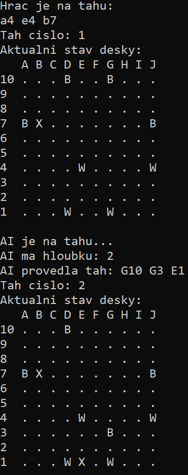

# Uživatelská dokumentace: Hra Amazonky

Tento dokument slouží jako stručný průvodce kompilací, spuštěním a ovládáním deskové hry Amazonky proti umělé inteligenci.

## 1. Kompilace a spuštění
Program je napsán v jazyce Haskell. Pro maximální výkon umělé inteligence je nutné hru zkompilovat s optimalizační vlajkou `-O2`. 

Otevřete terminál ve složce s projektem a zadejte následující příkazy:

**Kompilace:**
> `ghc -O2 amazonky.hs`

**Spuštění:**
> `.\amazonky.exe`

## 2. Ovládání a pravidla zadávání tahů
Hra probíhá tahově v textovém rozhraní. Hráč hraje za bílé figurky (`W`), umělá inteligence za černé (`B`). Prázdná pole jsou značena tečkou (`.`) a vystřelené šípy křížkem (`X`).

Když vás program vyzve textem `Hrac je na tahu:`, očekává se zadání tahu ve specifickém formátu. Tah se skládá ze tří souřadnic oddělených mezerou:
1. **Startovní pole** (Kde vaše amazonka stojí)
2. **Cílové pole** (Kam se amazonka přesune)
3. **Dopad šípu** (Kam amazonka z nového místa vystřelí)

Souřadnice se zadávají jako písmeno sloupce (A-J) a číslo řádku (1-10). Na velikosti písmen nezáleží.

### Formát příkazu:
`[START] [CÍL] [ŠÍP]`

## 3. Typické příklady použití

**Příklad 1: První tah v partii**
Hráč se rozhodne vzít bílou amazonku z pole `D1`, posunout ji po diagonále na pole `D4` a z něj vystřelit šíp na `D5`.
Do konzole napíše:
> `D1 D4 D5`

**Příklad 2: Řešení neplatného tahu**
Pokud hráč zadá tah, který blokuje jiná figurka, šíp, nebo je syntakticky špatně, program tah odmítne a vyzve hráče k zadání nového tahu:
> `Neplatny tah, zkuste to znovu.`

## 4. Ukázka ze hry
Níže je vidět stav herní desky po úvodním kole.

